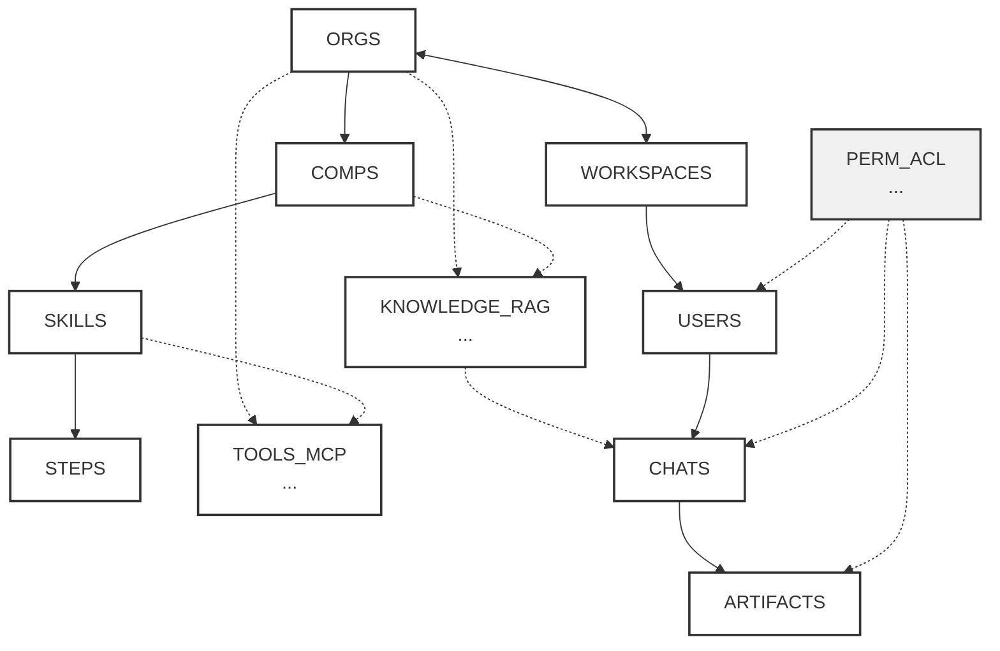

# 🏗️ DIAGRAMA DE ARQUITETURA - HUMANA AI COMPANIONS

**Documento**: Diagrama de arquitetura do sistema Humana AI Companions  
**Versão**: 1.0  
**Data**: 2025-01-15  
**Fonte**: Rabisco Edu

---

## 📊 DIAGRAMA MERMAID

**ENUMs**: Roles, Resources, Actions, Class, Restricts

**Nota**: ENUMs: Roles, Resources, Actions, Class, Restricts

---

## 🎨 RELACIONAMENTOS

### **Hierarquia Principal:**
- **ORGS** → WORKSPACES (1:N)
- **WORKSPACES** → USERS (N:N)
- **ORGS** → COMPS (1:N)
- **COMPS** → SKILLS (1:N)
- **SKILLS** → STEPS (1:N)

### **Funcionalidades:**
- **USERS** → CHATS (1:N)
- **CHATS** → ARTIFACTS (1:N)

### **Sistemas Transversais:**
- **KNOWLEDGE_RAG** → COMPS, CHATS (suporte)
- **TOOLS_MCP** → COMPS, SKILLS (execução)
- **PERM_ACL** → USERS, CHATS, ARTIFACTS (segurança)

---

## 📋 LEGENDA

| Símbolo | Significado |
|---------|-------------|
| `→` | Relacionamento direto (FK) |
| `-.->` | Relacionamento de suporte/referência |
| **Rosa** | Sistemas de infraestrutura (RAG, MCP) |
| **Azul** | Sistema de segurança (ACL) |

---

## 🔑 ENUMs DO SISTEMA

Conforme anotação no diagrama:

- **Roles**: Papéis de usuários no sistema
- **Resources**: Tipos de recursos (ORG, WSP, CMP, PRL, CHT, KNW, TOL)
- **Actions**: Ações possíveis (REA, WRI, UPD, MNG)
- **Class**: Classificação de acesso (PUB, ORG, WSP, PVT)
- **Restricts**: Restrições de sensibilidade (PII, FIN, COF)

---

**Documento gerado em**: 2025-01-15  
**Versão**: 1.0  
**Status**: ✅ Aprovado
